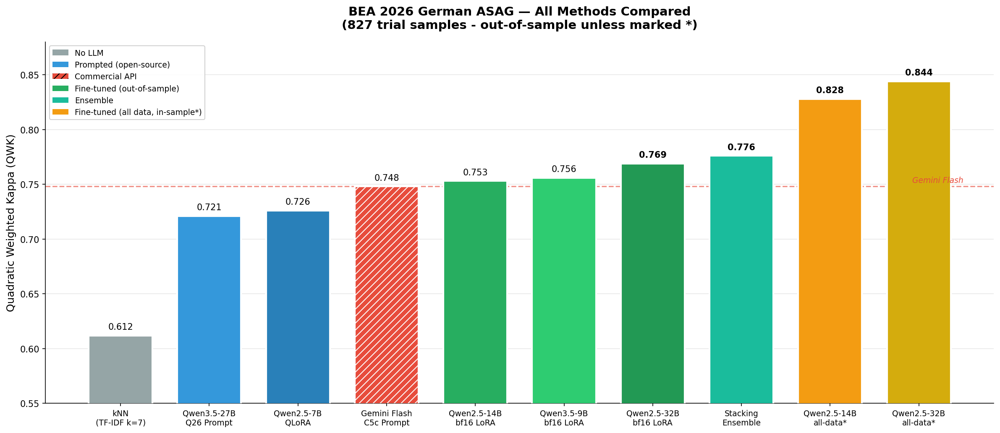
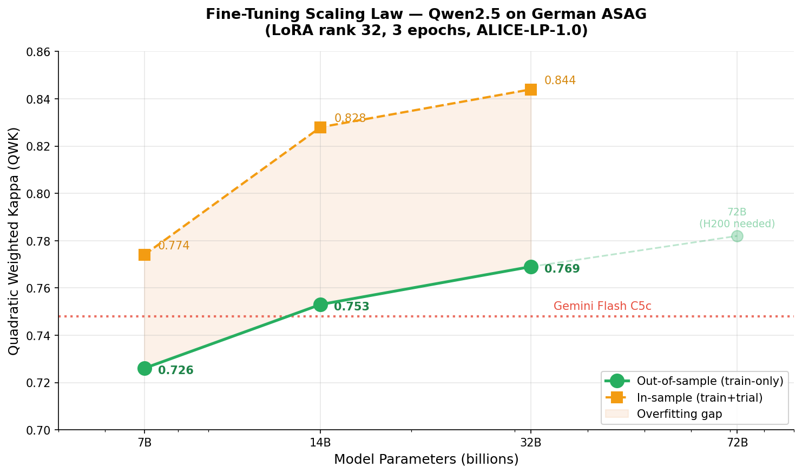
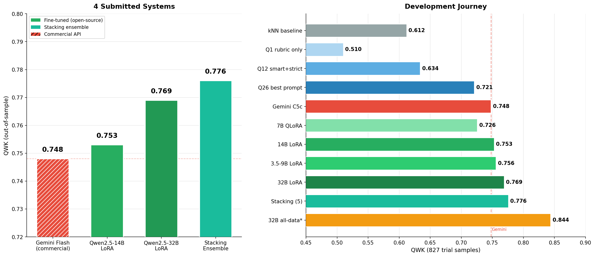
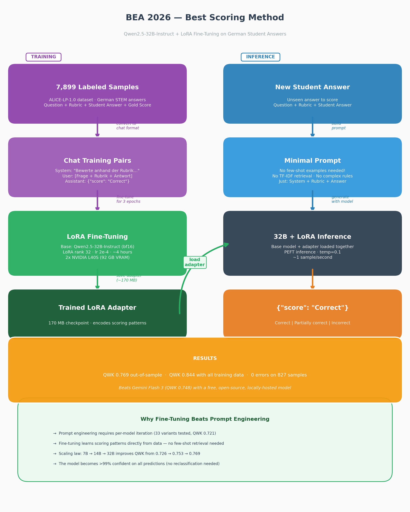

:toc:
:toc-title:
:toclevels: 5
:toc-placement!:

= BEA 2026 Shared Task — Rubric-based Short Answer Scoring for German

System for the link:https://edutec.science/bea-2026-shared-task/[BEA 2026 Shared Task] at ACL 2026.
Predicts rubric-based scores (Correct / Partially correct / Incorrect) for German student answers
on the ALICE-LP-1.0 dataset.

*Authors:* https://github.com/jonasgwozdz[Jonas Gwozdz], https://github.com/anbo-de[Andreas Both] — https://www.htwk-leipzig.de/en/htwk-leipzig[Leipzig University of Applied Sciences (HTWK Leipzig)] / https://wse-research.org/#[Web & Software Engineering Research Group (WSE Research)]

*Status:* Final official leaderboard published 2026-04-07. *WSE Research placed #2 on three tracks (T1 3-way seen 0.790, T2 2-way seen 0.717, T3 3-way unseen 0.672) and #3 on Track 4 (2-way unseen 0.533).*

---

toc::[]

== Results Overview

== Submission Results

== Pipeline Architecture

== Best Results (827 trial samples, unbiased unless marked)

[options="header"]
|===
| System | QWK | Acc | Method
| Qwen2.5-72B QLoRA (all data)  | 0.851* | 83.4% | NF4 QLoRA, r=32, 3 epochs (in-sample)
| Qwen2.5-32B LoRA (all data)   | 0.844* | 82.6% | bf16 LoRA, r=32, 3 epochs (in-sample)
| Qwen2.5-14B LoRA (all data)   | 0.828* | 80.9% | bf16 LoRA, r=32, 3 epochs (in-sample)
| Weighted vote (7B+14B+32B+Gemini) | 0.781 | —    | QWK-proportional majority (3-way), LOO-CV
| LogReg stacking (5-cand pool) | 0.776 | 75.5% | Meta-learner over FT/prompt/kNN (superseded)
| Qwen2.5-32B LoRA              | 0.769 | 75.7% | Train-only unbiased
| Qwen2.5-72B QLoRA             | 0.768 | 75.7% | Train-only unbiased (scaling plateau)
| Qwen3.5-9B LoRA               | 0.756 | 74.2% | Train-only unbiased
| Qwen2.5-14B LoRA              | 0.753 | 74.1% | Train-only unbiased
| Gemini 3 Flash (C5c prompt)   | 0.748 | 73.6% | Commercial API baseline
| Qwen2.5-7B QLoRA              | 0.726 | 70.9% | Train-only unbiased
| Qwen3.5-27B (Q26 prompt)      | 0.719 | 70.2% | Best prompt-only, open-source
| TF-IDF kNN (k=7)              | 0.612 | 64.5% | No LLM needed
|===

*in-sample (trial included in training data, as allowed by task rules)

*Understanding our evaluation numbers:* The test set has no labels — results are published April 3. To estimate performance, we evaluated two ways on the 827-sample trial set:

* *Out-of-sample (unbiased):* Model trained on 7,072 training samples only, then scored on the 827 trial samples it has _never seen_. This is the honest estimate of real test performance. Our best: *32B at QWK 0.769*.
* *In-sample (optimistic):* Model trained on _all_ 7,899 samples (training + trial), then scored on the same trial samples it was trained on. This inflates the score due to memorization. Our best: *32B at QWK 0.844*.

The task rules allow training on trial data for submissions, so our submitted models use all 7,899 samples for maximum performance. The real test QWK will likely fall between the out-of-sample (0.769) and in-sample (0.844) estimates.

== Winning Submission per Track (official, 2026-04-07)

The shared task defines four evaluation tracks combining two dimensions:

[options="header"]
|===
|  | 3-way scoring | 2-way scoring
| *Seen questions* (2,008 samples) | Track 1 | Track 2
| *Unseen questions* (3,086 samples) | Track 3 | Track 4
|===

* *3-way* (Tracks 1 & 3): Predict _Correct_, _Partially correct_, or _Incorrect_
* *2-way* (Tracks 2 & 4): Binary classification — _Correct_ vs _Incorrect_ (Partially correct is merged into Incorrect)
* *Seen questions*: New answers to questions the model saw during training
* *Unseen questions*: Answers to 39 entirely new questions with new rubrics — the hardest track

[options="header"]
|===
| Track | QWK | Rank | Submitted system
| T1 — 3-way seen questions   | 0.790 | *#2* | QWK-weighted majority vote over {Qwen2.5-7B, 14B, 32B, Gemini 3 Flash}
| T2 — 2-way seen questions   | 0.717 | *#2* | Direct binary majority vote over {Qwen2.5-14B, 32B, Gemini 3 Flash}
| T3 — 3-way unseen questions | 0.672 | *#2* | Qwen2.5-72B QLoRA solo
| T4 — 2-way unseen questions | 0.533 | *#3* | Qwen2.5-72B QLoRA solo
|===

Ensemble composition and voting strategy were selected by exhaustive LOO-CV
search over all subsets of six candidate scorers (5 fine-tuned Qwen models at
7B/14B/32B/72B/Qwen3.5-9B + prompt-only Gemini C5c + prompt-only Qwen3.5-27B
Q26 + TF-IDF kNN k=7) on the 827-sample trial set. Trained meta-learners
(LogReg, Ridge, GBM, XGBoost) underperformed QWK-weighted voting at this
dataset size. Results on link:https://www.codabench.org/competitions/14622/[CodaBench].

== Repository Structure

----
├── data/raw/                     # ALICE-LP-1.0 data (train, trial, test)
├── src/
│   ├── common/                   # Shared utilities (OpenRouter client, data loaders)
│   ├── strategy_a..c6b/          # Gemini prompt engineering (A→C5c)
│   └── strategy_qwen/            # Open-source track
│       ├── prompting/            # Qwen3.5-27B: 33 prompt variants, 8 rounds
│       ├── finetuning/           # LoRA fine-tuning: 7B/14B/32B/72B
│       └── evaluation/           # Scoring, ensemble, confidence threshold
├── results/strategy_qwen/        # 110+ metrics and prediction files
├── submissions/codabench/        # CodaBench-ready zip files
├── models/                       # LoRA adapters (gitignored)
└── docs/                         # Diagrams
----

See link:src/strategy_qwen/README.md[+src/strategy_qwen/README.md+] for detailed reproduction steps.

== Approach

=== Track 1: Prompt Engineering

* *Gemini 3 Flash* (C5c): 6 iterative strategies, TF-IDF smart examples, adaptive difficulty → QWK 0.748
* *Qwen3.5-27B* (Q26): 33 variants from scratch, German prompts, rubric-first → QWK 0.721

Key finding: *prompt-model coupling is checkpoint-specific* — prompts don't transfer across models.

=== Track 2: Fine-Tuning

LoRA fine-tuning of Qwen2.5 models (7B / 14B / 32B / 72B) + Qwen3.5-9B:

* Both 14B (0.753) and 32B (0.769) *beat Gemini Flash* on unbiased out-of-sample evaluation
* Diminishing returns on scaling: 7B→14B (+0.027), 14B→32B (+0.016), 32B→72B (−0.001 on trial, +0.061 on unseen-questions test track)
* Qwen3.5-9B (0.756) outperforms Qwen2.5-14B (0.753) — model generation matters
* 72B trained on H200 via NF4 QLoRA (42 GB model footprint, 66 GB peak, 17 h)

=== Track 3: Ensemble

QWK-proportional weighted majority voting over fine-tuned + prompted models
(composition depends on track, see "Winning Submission per Track" above). Best
unbiased trial ensemble: 4-model weighted vote → QWK 0.781 (LOO-CV). A
logistic-regression stacker over the same candidate pool reached 0.776 and was
superseded by simpler voting on the small (78 questions) trial set.

== Hardware

* Prompt engineering and fine-tuning up to 32B: 2× NVIDIA L40S (46 GB VRAM each), CUDA 13.1, Ubuntu 22.04
* 72B fine-tuning: 1× NVIDIA H200 NVL (141 GB VRAM), NF4 QLoRA
* Fine-tuning: bf16 LoRA at 14B/32B (bitsandbytes 4-bit broken on L40S + CUDA 13.1 for models > 7B)
* Serving: vLLM for merged models, direct PEFT for 32B/72B inference

== Paper §5.3 Error-Analysis Reproduction

`python -m src.strategy_qwen.analysis.error_patterns` reproduces all numbers
reported in §5.3 of the paper (adjacent/skip-level error splits, leniency
ratio, per-class precision, cross-model unanimous rates, 72B-vs-majority
disagreement, distribution shift, short-answer classification rates). Cached
output: `docs/error_patterns_53.txt`.

== How do I cite this work?

[source,bibtex]
----
@inproceedings{gwozdz2026bea,
  title={WSE Research at BEA 2026 Shared Task 2: Multi-Strategy Rubric-Based Short Answer Scoring for German},
  author={Jonas Gwozdz and Andreas Both},
  booktitle={Proceedings of the 21st Workshop on Innovative Use of NLP for Building Educational Applications (BEA 2026)},
  publisher = "Association for Computational Linguistics",
  year={2026}
}
----

== Links

* Shared task: https://edutec.science/bea-2026-shared-task/
* BEA 2026: https://sig-edu.org/bea/2026
* CodaBench: https://www.codabench.org/competitions/14622/
