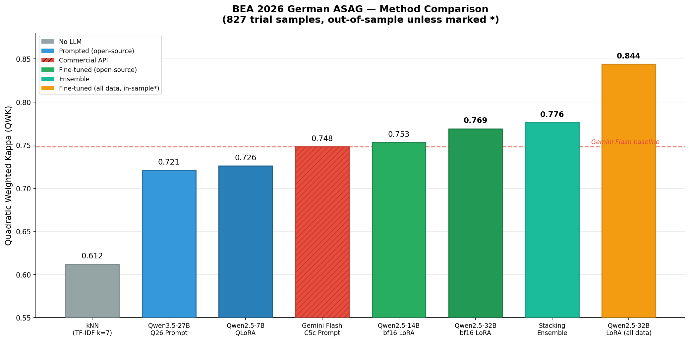
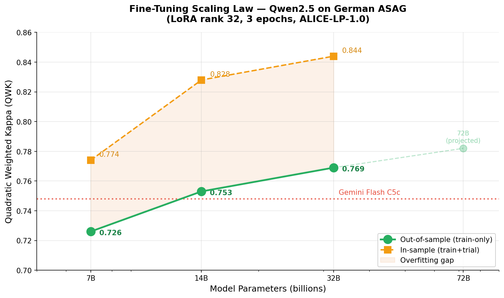
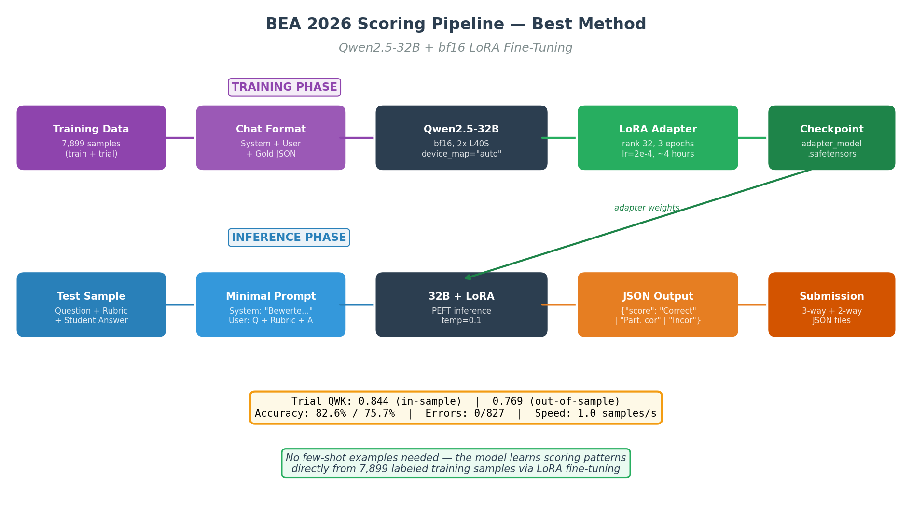

# BEA 2026 Shared Task — Rubric-based Short Answer Scoring for German

System for the [BEA 2026 Shared Task](https://edutec.science/bea-2026-shared-task/) at ACL 2026.
Predicts rubric-based scores (Correct / Partially correct / Incorrect) for German student answers
on the ALICE-LP-1.0 dataset.

**Authors:** Jonas Gwozdz, Andreas Both — HTWK Leipzig / WSE Research

## Results Overview





## Pipeline Architecture



## Best Results (827 trial samples)

| System | QWK | Acc | Method |
|--------|-----|-----|--------|
| Qwen2.5-32B LoRA (all data) | 0.844* | 82.6% | bf16 LoRA fine-tune, r=32, 3 epochs |
| Qwen2.5-32B LoRA (train-only) | 0.769 | 75.7% | Unbiased out-of-sample |
| Stacking ensemble (5 models) | 0.776 | 75.5% | LogReg over 3 FT + Q26 prompt + kNN |
| Qwen2.5-14B LoRA (train-only) | 0.753 | 74.1% | Unbiased out-of-sample |
| Gemini 3 Flash (C5c prompt) | 0.748 | 73.6% | Commercial API baseline |
| Qwen3.5-27B (Q26 prompt) | 0.721 | 70.2% | Best prompt-only, open-source |
| Qwen2.5-7B QLoRA (train-only) | 0.726 | 70.9% | Unbiased out-of-sample |
| TF-IDF kNN (k=7) | 0.612 | 64.5% | No LLM needed |

*in-sample (trial included in training data, as allowed by task rules)

## Repository Structure

```
├── data/
│   └── raw/3way/              # ALICE-LP-1.0 training + trial data
├── src/
│   ├── common/                # Shared utilities (OpenRouter client, data loaders)
│   ├── strategy_a_rubric_only/   # Gemini: rubric-only baseline
│   ├── strategy_b_rubric_rules/  # Gemini: + decision rules
│   ├── strategy_c*_*/            # Gemini: iterative prompt development (A→C5c)
│   ├── strategy_c6*_*/           # Claude Sonnet / GPT experiments
│   └── strategy_qwen/           # Open-source track (see strategy_qwen/README.md)
│       ├── prompting/           # Qwen3.5-27B prompt engineering (33 variants, 8 rounds)
│       ├── finetuning/          # LoRA fine-tuning (7B/14B/32B/72B)
│       └── evaluation/          # Scoring, ensemble, confidence threshold
├── results/
│   ├── strategy_c5c/           # Gemini Flash C5c results
│   └── strategy_qwen/          # All Qwen results (110 files)
├── models/                     # LoRA adapters (gitignored, local only)
└── submissions/                # Test set submission files
```

## Quick Start

### Score with the fine-tuned submission model

```bash
# Prerequisites
pip install torch transformers peft scikit-learn

# Score test data with 32B fine-tuned model (direct PEFT inference, 2 GPUs)
python -m src.strategy_qwen.evaluation.score_32b_direct

# Or comprehensive pipeline (32B + 14B + kNN + ensemble)
python -m src.strategy_qwen.evaluation.score_test_comprehensive \
  --test-3way data/raw/3way/ALICE_LP_test_3way.json
```

### Score with Gemini Flash (commercial API)

```bash
# Requires OPENROUTER_API_KEY in .env
python -m src.strategy_c5c_adaptive.run --split test --workers 5
```

### Reproduce fine-tuning

```bash
# 32B all-data (submission model, ~4h on 2×L40S)
pip install peft trl datasets accelerate
python -m src.strategy_qwen.finetuning.finetune_32b_alldata

# 14B all-data (faster, ~2.5h on 1×L40S)
CUDA_VISIBLE_DEVICES=0 python -m src.strategy_qwen.finetuning.finetune_14b_alldata
```

## Approach Summary

### Track 1: Prompt Engineering

Iterative prompt development for two model families:

- **Gemini 3 Flash** (commercial): 6 strategies (A→C5c), TF-IDF smart example selection,
  adaptive difficulty → QWK 0.748
- **Qwen3.5-27B** (open-source): 33 variants across 8 rounds, developed from scratch
  (German prompts + TF-IDF + rubric-first + strict calibration) → QWK 0.721

Key finding: **prompt-model coupling is checkpoint-specific** — prompts optimized for one model
don't transfer, even within the same model family.

### Track 2: Fine-Tuning

LoRA fine-tuning on the ALICE-LP training data (7,072 samples, or 7,899 with trial):

- Scaling: 7B (0.726) → 14B (0.753) → 32B (0.769) with diminishing returns
- Both 14B and 32B **beat Gemini Flash** on unbiased out-of-sample evaluation
- Fine-tuned models are >99% confident on all predictions (no low-confidence reclassification possible)

### Track 3: Ensemble

LogReg stacking over 5 models (32B FT + 14B FT + 7B FT + Q26 prompt + kNN):
QWK 0.776 with leave-one-question-out cross-validation — best unbiased result.

## Hardware

- GPU server: 2× NVIDIA L40S (46 GB VRAM each), CUDA 13.1
- Fine-tuning: bf16 LoRA (bitsandbytes 4-bit broken on L40S + CUDA 13.1)
- Prompt engineering: vLLM with tensor parallelism

## Links

- Shared task: https://edutec.science/bea-2026-shared-task/
- BEA 2026 workshop: https://sig-edu.org/bea/2026
- Submission portal: https://softconf.com/acl2026/bea2026/
