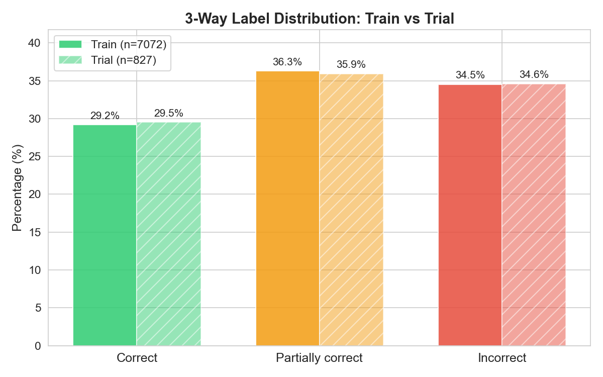
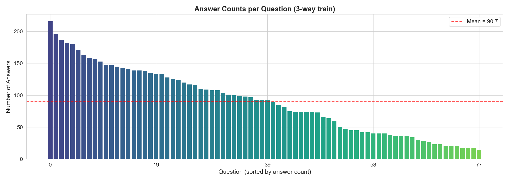
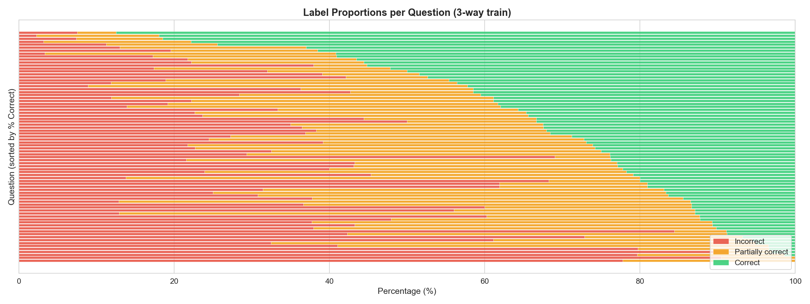
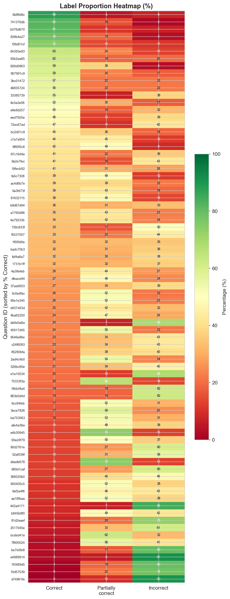
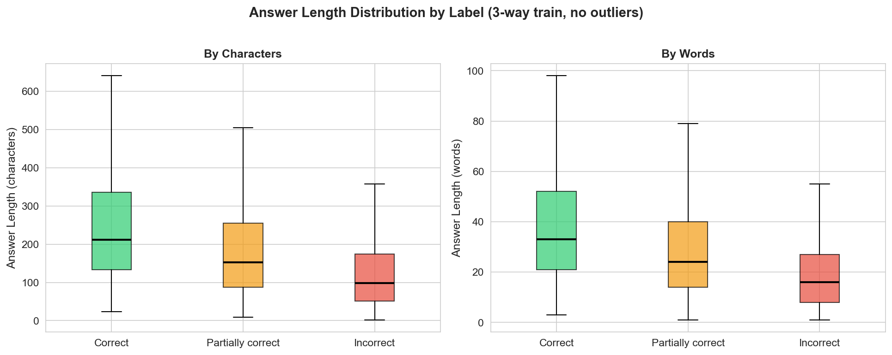
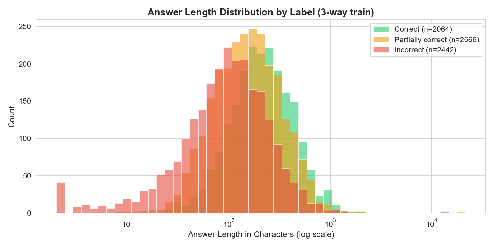

# ALICE-LP-1.0 Data Exploration Report

**Date:** 2026-03-17
**Dataset:** BEA 2026 Shared Task — Rubric-based Short Answer Scoring for German
**Version:** v2 (received 2026-03-17 via NextCloud)

---

## 1. Dataset Overview

| Property | Value |
|----------|-------|
| Total samples | 7,899 (train 7,072 + trial 827) |
| Unique questions | 78 (77 unique texts — one text shared by 2 question_ids) |
| Split method | Question-wise stratified 90/10 |
| Language | German |
| Domains | Chemistry, Biology, Physics, Mathematics, Other |
| Score levels | 3-way: Correct / Partially correct / Incorrect |
| Score levels (2-way) | Correct / Incorrect (Partially correct → Incorrect) |

**Important casing note:** Labels use `"Partially correct"` (lowercase c), not `"Partially Correct"`.

## 2. Label Distribution

### 3-way Classification

| Split | N | Correct | Partially correct | Incorrect |
|-------|---|---------|-------------------|-----------|
| Train | 7,072 | 2,064 (29.2%) | 2,566 (36.3%) | 2,442 (34.5%) |
| Trial | 827 | 244 (29.5%) | 297 (35.9%) | 286 (34.6%) |

### 2-way Classification

| Split | N | Correct | Incorrect |
|-------|---|---------|-----------|
| Train | 7,072 | 2,064 (29.2%) | 5,008 (70.8%) |
| Trial | 827 | 244 (29.5%) | 583 (70.5%) |

The label distribution is reasonably balanced for 3-way, with a slight majority for "Partially correct". The 2-way task has a 70/30 imbalance favoring "Incorrect" — a naive majority-class baseline would achieve 70.8% accuracy but QWK ≈ 0.

### 2-way / 3-way Consistency

Verified: 2-way files map {Partially correct, Incorrect} → Incorrect, with zero violations. Note that IDs are regenerated in the 2-way files (no UUID overlap with 3-way), so matching must be done by answer text.

## 3. Per-Question Analysis

### Answers per Question

- Range: **15–216 answers per question**
- Mean: 90.7, Median: 92
- Distribution is fairly uniform — most questions have 60–120 answers

### Question Difficulty

Questions vary dramatically in difficulty:

**Hardest questions** (highest % Incorrect):
| Question ID | % Incorrect | % Correct | N | Topic (excerpt) |
|------------|-------------|-----------|---|-----------------|
| e4989914 | 91.2% | 2.9% | 34 | — |
| d74961fe | 90.5% | 4.8% | 21 | — |
| 442a4171 | 84.4% | 3.1% | 32 | "Formuliere selbst eine Fragestellung" |

**Easiest questions** (highest % Correct):
| Question ID | % Correct | % Incorrect | N | Topic (excerpt) |
|------------|-----------|-------------|---|-----------------|
| 0bf8fd8c | 87.5% | 7.8% | 128 | — |
| 741376db | 82.0% | 8.0% | 50 | — |
| b076d670 | 81.5% | 11.1% | 54 | — |

**24 question-label combinations** have >60% dominance of a single class — these "easy" questions inflate overall accuracy but provide less signal for discriminating between labels.

## 4. Domain Classification

Questions were classified by content keywords into STEM domains:

| Domain | Questions | Answers | % of Data |
|--------|-----------|---------|-----------|
| Chemistry | 22 | 2,208 | 31.2% |
| Other/Unclear | 18 | 1,760 | 24.9% |
| Biology | 17 | 1,412 | 20.0% |
| Physics | 16 | 1,375 | 19.4% |
| Mathematics | 5 | 317 | 4.5% |

Chemistry dominates. The "Other/Unclear" bucket (18 questions, 1,760 answers) contains generic prompts like "Begründe deine Auswahl!" and "Erläutere, warum du 'Wahr' oder 'Falsch' angekreuzt hast" that lack domain-specific keywords. Mathematics is underrepresented with only 5 questions.

## 5. Answer Length Analysis

### Overall Statistics

| Metric | Characters | Words |
|--------|-----------|-------|
| Mean | 201.8 | 31.8 |
| Median | 148 | 23 |
| Std | 350.0 | 51.2 |
| Min | 2 | 1 |
| Max | 21,474 | 3,019 |
| P5 | 30 | — |
| P25 | 82 | — |
| P75 | 256 | — |
| P95 | 525 | — |

### Length by Label

| Label | Mean (chars) | Median (chars) |
|-------|-------------|----------------|
| Correct | 266.7 | 212 |
| Partially correct | 208.1 | 153 |
| Incorrect | 140.4 | 98 |

**Strong length-label correlation:** Correct answers are nearly 2× longer than Incorrect ones on average. This is a useful signal but also a potential confounder — a model might learn to score by length rather than content.

### Length Quartiles × Label

| Quartile | % Correct | % Part. correct | % Incorrect |
|----------|-----------|-----------------|-------------|
| Q1 (shortest) | 10.7% | 31.6% | 57.7% |
| Q2 | 25.5% | 40.5% | 34.0% |
| Q3 | 34.5% | 38.1% | 27.4% |
| Q4 (longest) | 46.5% | 36.1% | 17.4% |

### Edge Cases

- **Very short answers (<20 chars):** 202 answers — 190 Incorrect (94%), 12 Partially correct (6%), 0 Correct
- **Very long answers (>1000 chars):** 42 answers — 24 Correct, 12 Partially correct, 6 Incorrect
- **Non-answers:** 34 found ("?", ".", "-", "/", ":)", "Keine Ahnung", "Weiß ich nicht", "Kp", "Yo-yo") — all labeled Incorrect
- **Extreme outliers:** A 21,474-char answer (Partially correct) and a 13,966-char answer (Incorrect), both containing copy-pasted Wikipedia text

## 6. Rubric Analysis

### Rubric Structure

- Rubrics are **consistent within each question** (verified across all samples)
- Average rubric text length: Correct = 168 chars, Partially correct = 166 chars, Incorrect = 124 chars
- Incorrect rubrics are ~25% shorter than Correct/Partially correct rubrics

### Rubric Patterns

- 85% of rubrics start with "Die Schüler:innen" or "Die SuS"
- **Correct** rubrics use terms like "umfassend", "vollständig", "korrekt"
- **Partially correct** rubrics use "teilweise", "entweder...oder" (partial fulfillment)
- **Incorrect** rubrics use "weder...noch", "nicht" (negation of criteria)
- 8/78 rubrics are **vague** — relying purely on umfassend/teilweise/nicht without specific criteria

### Rubric Specificity Concern

Some rubrics describe **competencies** rather than keyword checklists (e.g., "Die Schüler:innen beurteilen die Verderblichkeit umfassend auf Basis des Kollisionsmodells"). This requires models to understand and apply abstract rubric semantics, not just pattern-match.

## 7. Train vs Trial Consistency

- Same 78 questions appear in both splits
- Label distributions are generally well-aligned
- Mean deviation: 4.98 percentage points
- Median deviation: 2.56 pp
- **Caveat:** Maximum deviation is 73.3 pp for question `90d2761e` (only 15 samples, 2 in trial) — small-sample artifact. Top deviations all come from questions with very few samples (15–23).

## 8. Language and Text Patterns

- 45% of answers lack final punctuation
- 6.4% start with lowercase
- Colloquial German is rare (7× "halt", 3× "irgendwie")
- 17.4% contain numbers
- 3.7% contain chemical formulas
- 6.1% contain units
- Most answers are 1–2 sentences (61%)
- Student language is generally well-formed German with occasional spelling errors

## 9. Modeling Implications

### Opportunities
1. **Balanced labels** — no extreme class imbalance, standard loss functions should work
2. **Consistent rubric format** — structured "Schüler:innen..." pattern enables systematic prompting
3. **Strong length signal** — answer length correlates with score, can be used as a feature
4. **78 questions with ~91 answers each** — enough for per-question few-shot selection

### Challenges
1. **Rubric vagueness** — 8/78 rubrics are vague, requiring models to infer scoring criteria
2. **Competency-based rubrics** — rubrics describe understanding levels, not keyword checklists
3. **Domain breadth** — Chemistry, Biology, Physics, Math require broad STEM knowledge in German
4. **Non-answers and noise** — 34 explicit non-answers, 202 very short answers, 2 Wikipedia copy-paste outliers
5. **"Partially correct" boundary** — the most ambiguous label; the boundary between "Partially correct" and "Incorrect" is inherently subjective
6. **Per-question difficulty variation** — some questions are near-trivial (87% Correct), others near-impossible (91% Incorrect) for students
7. **Answer length as confounder** — models might learn length heuristics rather than content scoring
8. **Generic questions** — 18 questions lack domain keywords ("Begründe deine Auswahl!"), requiring context from the rubric alone

### Recommendations for Scoring Pipeline
1. Use rubric text as primary input signal (not just question + answer)
2. Include per-question few-shot examples (RAG-based selection from training set)
3. Handle edge cases: empty/non-answers should be auto-classified as Incorrect
4. Consider per-question evaluation during development (overall QWK hides per-question failures)
5. Test with and without answer length as explicit feature to measure its contribution vs. confounding
6. For unseen-questions track: focus on rubric understanding rather than question-specific patterns

---

*Generated 2026-03-17. Figures in `notebooks/figures/`.*
